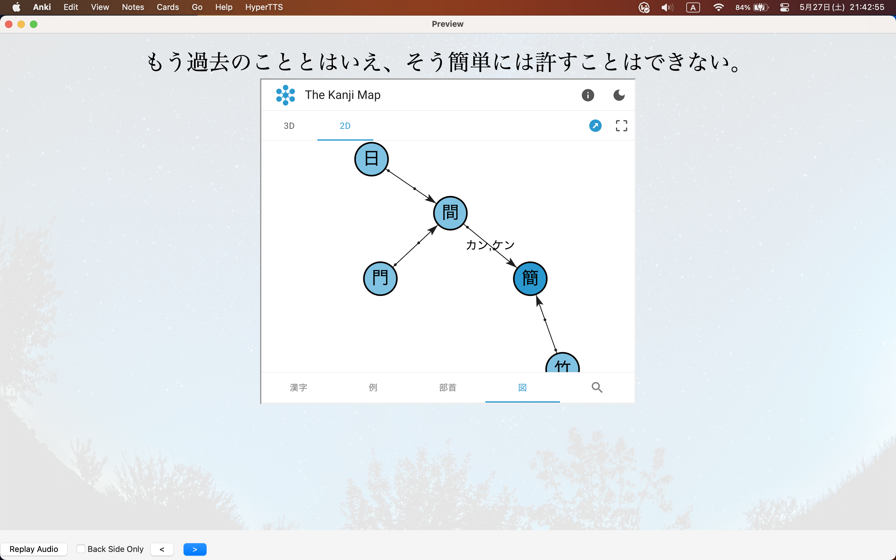
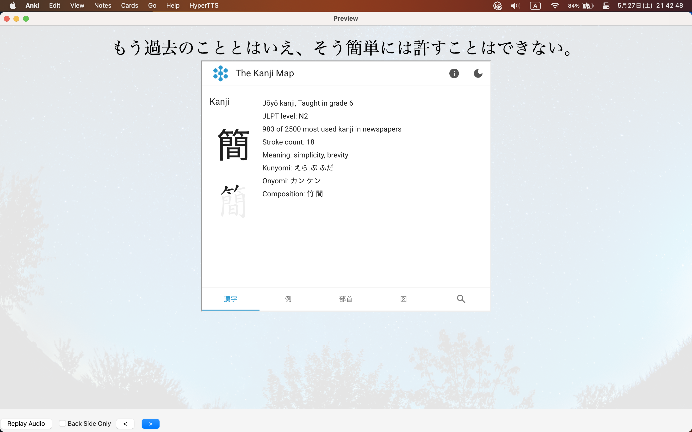
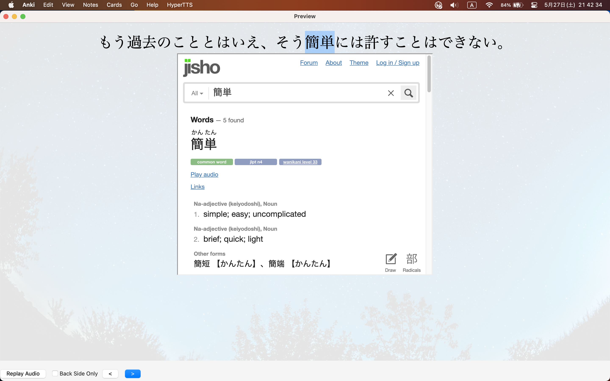
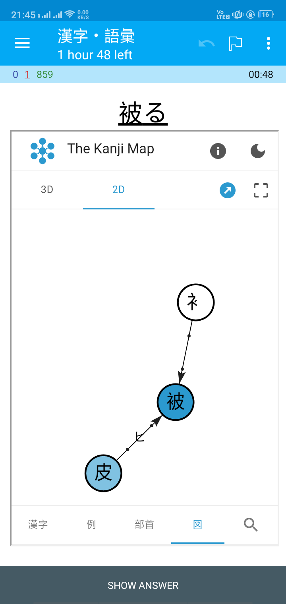
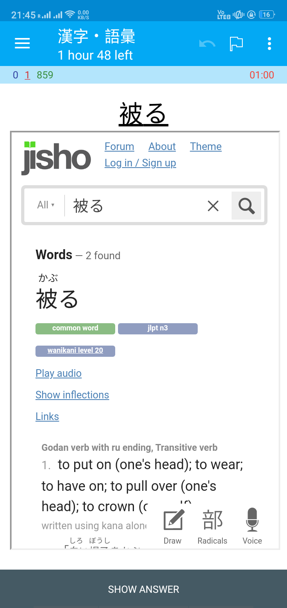

# Kanji Map Jisho Front Card Template for Anki

Select a kanji to preview it on https://thekanjimap.com

Highlight word(s) to look it up on https://jisho.org

Check out https://docs.ankiweb.net/templates/intro.html on how to modify the front card template.

